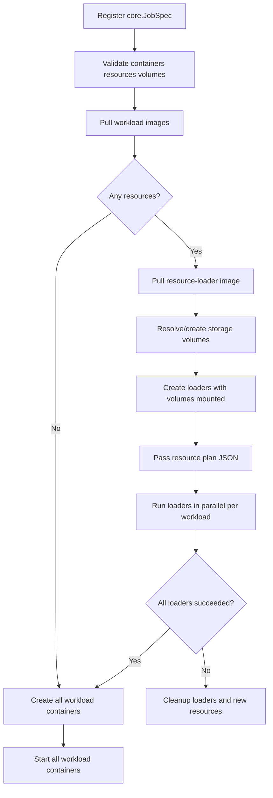

# Node Agent

The node agent is the data-plane process running on a machine that owns a
Docker daemon. It exposes separate admin and workload-proxy servers. The
admin side validates registration, prepares workloads, manages Docker, and
publishes lifecycle/resource events. The proxy only forwards approved traffic.

## Resource preparation

Resource preparation is a batch barrier: every required resource for every
declared container must finish before any workload container starts.



Events use a stable envelope with flexible metadata:

```json
{
  "id": "model-resource",
  "container_id": "ai-master",
  "type": "progress",
  "message": "resource download progress",
  "level": "info",
  "metadata": {
    "resource_id": "model-resource",
    "resource_type": "http",
    "downloaded_bytes": 52428800,
    "total_bytes": 104857600,
    "percentage": 50
  }
}
```

The frontend can consume `type: "progress"` events and render a progress
indicator without knowing installer-specific fields.

## Testing

Normal tests:

```bash
go test ./...
```

Docker-backed integration tests:

```bash
NODE_AGENT_TEST_PROXY_HOST=127.0.0.1 \
go test -tags integration ./services/node-agent \
  -run TestNodeAgentDockerIntegration -v
```
