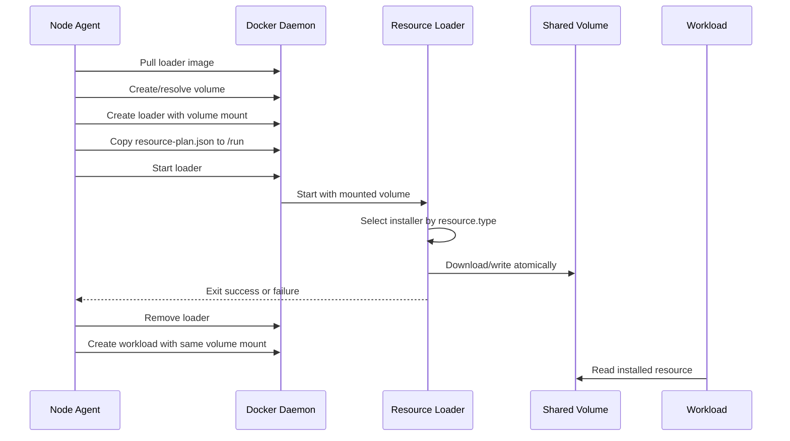
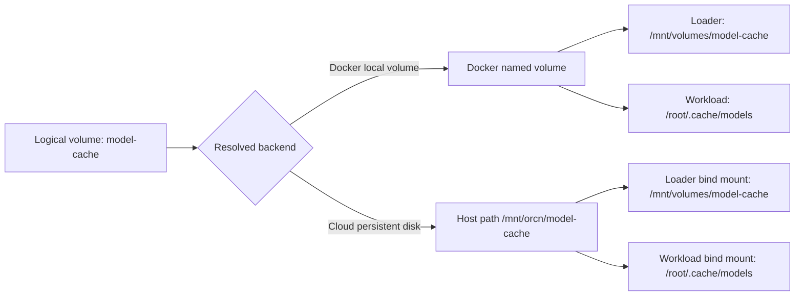

# Resource Loader

The resource loader is a short-lived helper container. It owns installer
implementations; the node agent owns orchestration and lifecycle.

The loader never creates workload containers. It receives a normalized plan,
writes resources into mounted storage, exits with a status code, and is then
removed by the node agent.

Implementation files:

```text
resource-loader/
├── main.go       # plan parsing and installer dispatch
├── http.go       # HTTP/HTTPS installer with atomic writes and progress logs
└── Dockerfile    # separate loader image
```

## Build and run independently

Build the loader image from the repository root:

```bash
docker build \
  -f services/node-agent/resource-loader/Dockerfile \
  -t vinitngr/orcn-resource-loader:dev .
```

Create a small loader plan:

```bash
printf '%s' '{
  "version": 1,
  "resources": [
    {
      "id": "post-one",
      "type": "http",
      "config": {
        "url": "https://jsonplaceholder.typicode.com/posts/1"
      },
      "destination": "/data/post.json"
    }
  ]
}' > /tmp/orcn-resource-plan.json
```

Run the loader with a Docker volume:

```bash
docker volume rm orcn-loader-test-volume 2>/dev/null || true

docker run --rm \
  --name orcn-resource-loader-test \
  --mount type=volume,source=orcn-loader-test-volume,target=/data \
  --mount type=bind,source=/tmp/orcn-resource-plan.json,target=/run/resource-plan.json,readonly \
  vinitngr/orcn-resource-loader:dev
```

Verify the installed file:

```bash
docker run --rm \
  --mount type=volume,source=orcn-loader-test-volume,target=/data \
  alpine:latest cat /data/post.json
```

Clean up the standalone test:

```bash
docker volume rm orcn-loader-test-volume
rm -f /tmp/orcn-resource-plan.json
```



## Storage mapping

The node agent resolves the storage backend before creating the loader.



The loader plan contains normalized destinations, for example:

```json
{
  "version": 1,
  "resources": [
    {
      "id": "model-resource",
      "type": "http",
      "config": {
        "url": "https://example.com/model.bin"
      },
      "destination": "/mnt/volumes/model-cache/models/model.bin"
    }
  ]
}
```

Installer selection is type-based:

```text
http         → HTTP installer
huggingface  → HuggingFace installer
s3           → S3 installer
git          → Git installer
```

Unknown types fail preparation. Resource credentials must be delivered through
temporary protected loader input and must never be written to logs or events.
